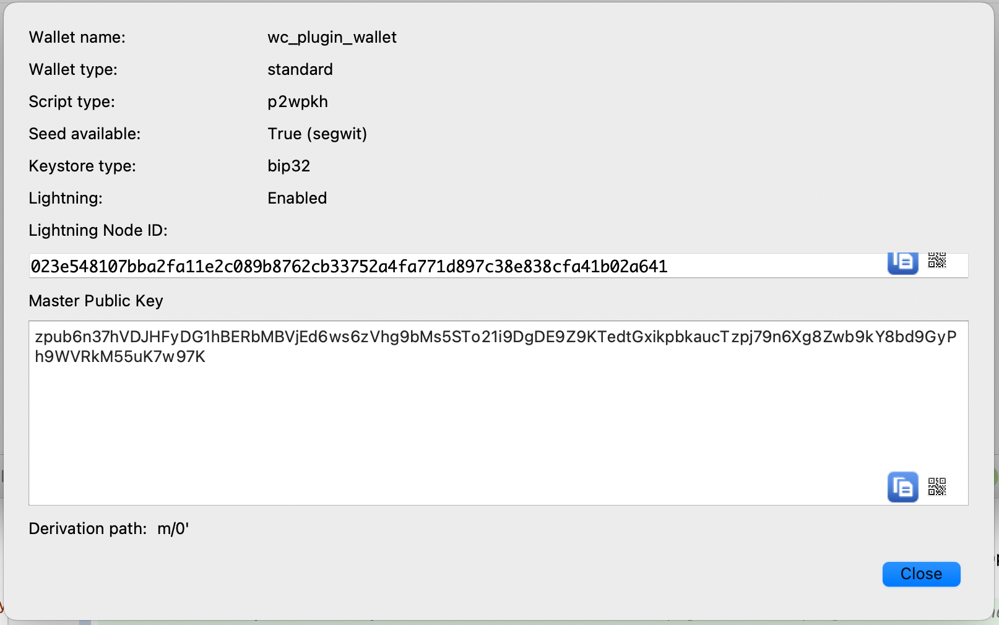
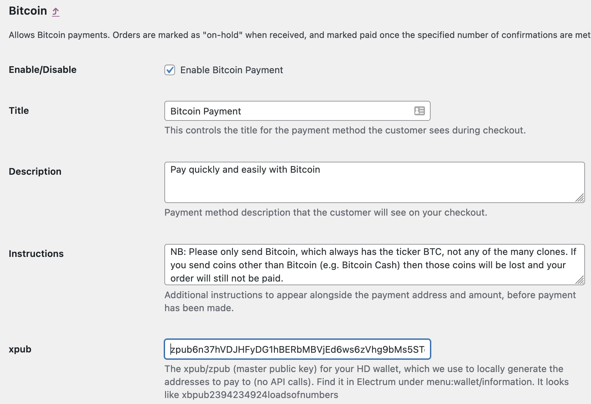
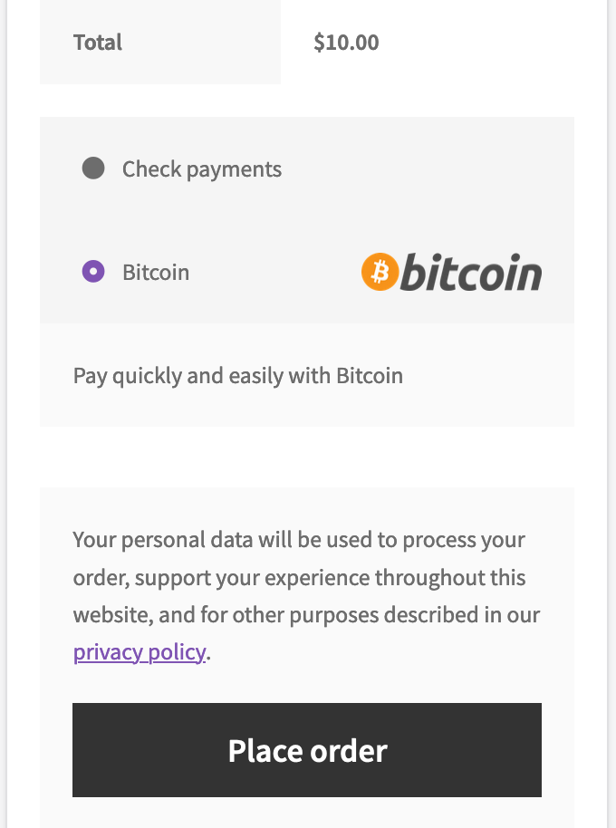
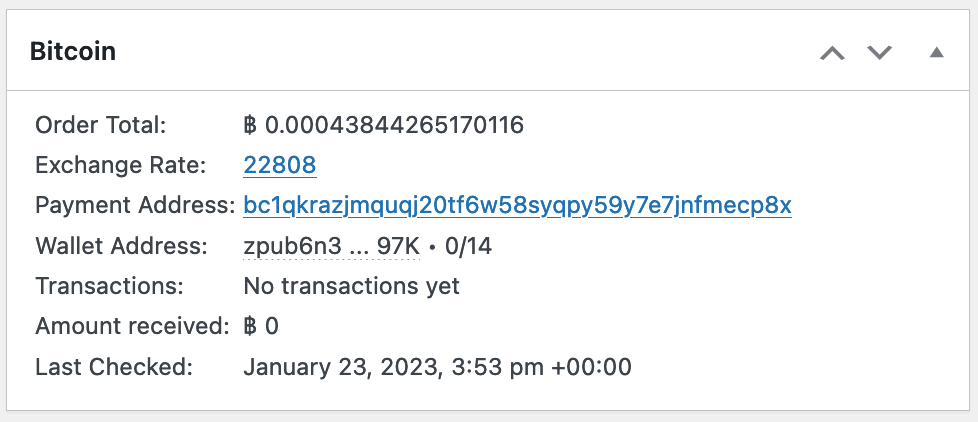

[](https://wordpress.org/plugins/woocommerce-gateway-bitcoin) [](https://github.com/WordPress-Coding-Standards/WordPress-Coding-Standards) [](https://brianhenryie.github.io/woocommerce-gateway-bitcoin/) [](https://github.com/szepeviktor/phpstan-wordpress) 

# WooCommerce Gateway Bitcoin

Self-custody Bitcoin gateway for WooCommerce. Bitcoin is paid directly into your wallet. Transactions are verified using public APIs. No private keys are stored on the server. No account is needed with any third party.

_The WooCommerce Bitcoin  gateway most philosophically aligned with WordPress and Bitcoin._

## Installation and Use

1. Download and install the latest version from [GitHub Releases](https://github.com/BrianHenryIE/woocommerce-gateway-bitcoin/releases/). In the admin dashboard under WooCommerce/Settings/Payments you should now see the payment option listed:


2. From your Bitcoin wallet, copy your "Master Public Key". E.g. using [Electrum Bitcoin Wallet](https://electrum.org/), it's in the menu under `Wallet`/`Infromation`. It should start with `xpub`, `zpub` or `ypub` and then a bunch of numbers:



3. Paste that into the payment gateway settings screen and save:



4. You will now be able to add an item to your cart, head to the checkout and see the Bitcoin payment option.



5. When an order is placed, a derived payment address is tied to this order and will not be reused. After checkout, this is what the customer will see:


* The QR code can be scanned or clicked, and contains the address and amount
* "Payment Address" and "Payment Total" are both links which copy the value to the clipboard
* "Last Checked" is a link which queries the blockchain for new transactions
* A background check runs every five minutes as long as the order remains on-hold
* The customer can view the same payment instructions under `my-account/orders/123`

6. In the WooCommerce admin order UI, the Bitcoin details are visible in a metabox:



7. WooCommerce's Action Scheduler regularly checks unpaid Bitcoin orders' addresses for new transactions, logs those transactions in the order notes, and marks the orders as paid once the expected amount of Bitcoin has been received.

## Notes

### Custom Post Types

Payment addresses are saved as a custom post type and their status can be seen in a standard WordPress list table:


Similarly, wallet addresses (xpubs / master public keys) are saved as a custom post type.

### Templates

All customer and admin UIs can be easily overridden using the standard WooCommerce templating system. 

### PHP Requirements

This plugin uses [Bit-Wasp/bitcoin-php](https://github.com/Bit-Wasp/bitcoin-php) to derive Bitcoin payment addresses on your server. This requires PHP's BC Math, Mcrypt and GMP extensions. The former two are provided by polyfill libraries, [phpseclib/bcmath_compat](https://github.com/phpseclib/bcmath_compat) and [phpseclib/mcrypt_compat](https://github.com/phpseclib/mcrypt_compat). The latter may be a problem if it is not installed on your server. You can check using `php -m | grep gmp`.

### APIs

Exchange rate:

* [Bitfinex](https://www.bitfinex.com/) - [API](https://docs.bitfinex.com/docs) - default
* [BitStamp](https://www.bitstamp.net/) - [API](https://www.bitstamp.net/api/) - implemented but not in use

Transactions:

* [SoChain](https://www.sochain.com/) - [API](https://sochain.com/api/) - default
* [Blockchain.com](https://blockchain.com) - [API](https://www.blockchain.com/api) - implemented but not in use
* [Blockstream.info](https://blockstream.info/) - [API](https://github.com/Blockstream/esplora/blob/master/API.md) - implemented but not in use

### Syncing received payments with wallets

Wallets only check a set number of addresses for payments and orders may be assigned an address outside the list your wallet is checking. If your store reports a payment has been received, you may need to configure your wallet to look at more addresses.

In the case of Electrum, in the menu choose `View`/`Show Console`, visit the `Console` tab, and set the lookahead value by typing the following:
```
wallet.change_gap_limit(200)
wallet.synchronize()
```

See: https://bitcoin.stackexchange.com/questions/63641/how-to-list-all-the-hd-address-in-electrum

## TODO

* Num-confirmations required, e.g.g for zero-conf payments (e.g. virtual products)
* Unpaid order expiry
* Partial payment email
* Show transactions in meta box on order page
* API failover
* Tor
* Units: Add mbtc as well as sats etc (to match default Electrum display settings)
* Zero-conf: to avoid the threat of fraud where the fee is low-balled, only accept zero-conf transactions whose fees are above recent expected range

## Contributing

See [BrianHenryIE/WordPress-Plugin-Boilerplate](https://github.com/BrianHenryIE/WordPress-Plugin-Boilerplate) for project setup rationale. 

# Acknowledgements

This plugin is forked from [Nullcorps/woocommerce-gateway-bitcoin](https://github.com/Nullcorps/woocommerce-gateway-bitcoin) who figured out the core functionality. The work here has been to implement that as a modern WordPress/WooCommerce plugin with Action Scheduler, CPTs, Composer, automated tests, WPCS, etc. Thank you  [NullCorps](https://github.com/Nullcorps)!

> I think this stuff below is correct, but idk.
>
> It's free, go nuts. I'm just sticking things together to make stuff.
>
> – Nullcorps


Big thank you to [@orionwl](https://twitter.com/orionwl) for talking things through along the way and patiently explaining the maths side of it over and over till I [Nullcorps] get it :)
